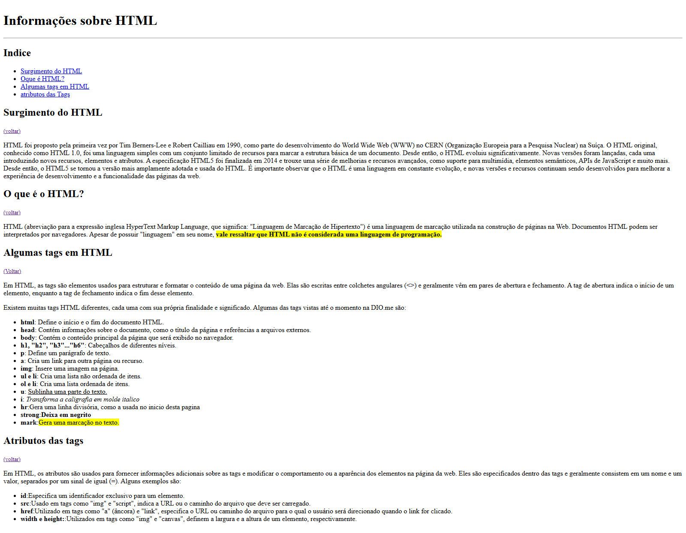

# 🧠 Aprendizado sobre HTML - Desafio Dio.me

Este projeto foi desenvolvido como parte de um desafio prático da plataforma [Dio.me](https://dio.me), com o objetivo de colocar em prática os primeiros conceitos de **HTML**.

## 📝 Sobre o Projeto

A proposta do desafio era criar uma página simples utilizando apenas HTML, abordando:

- A história do HTML
- O que é HTML
- Principais tags
- Atributos mais utilizados

O projeto contém navegação por âncoras e demonstração prática de diversas tags semânticas e estruturais.

## 🔧 Tecnologias Utilizadas

- HTML5

## 💡 O que aprendi

Durante esse projeto, pratiquei os seguintes conceitos:

- Estrutura básica de um documento HTML
- Uso de cabeçalhos, listas e parágrafos
- Criação de links internos com âncoras (`id` e `href`)
- Utilização de elementos semânticos como `<strong>`, `<mark>`, `<u>`, `<i>`, entre outros
- Aplicação de atributos como `id`, `href`, `src`, `width` e `height`

## 📸 Prévia

## 🔗 Acesse o projeto

Você pode visualizar este projeto publicado no GitHub Pages:

➡️ [Clique aqui para acessar](https://luis-fellipe.github.io/pagina-html-basica/)

📌 **Nota:** Esse projeto é focado no aprendizado de HTML e não utiliza CSS ou JavaScript.

## 📬 Contato

[Me encontre no LinkedIn](https://www.linkedin.com/in/luis-fellipe-real)

